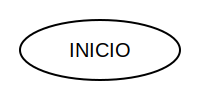
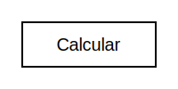
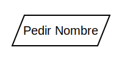
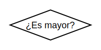
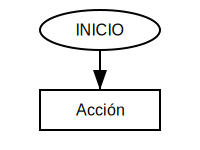
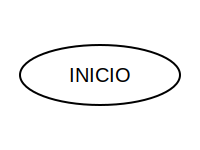
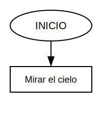
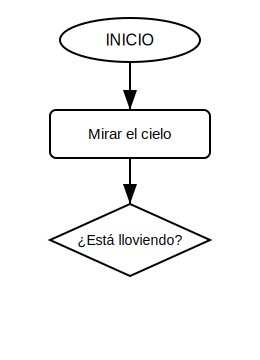
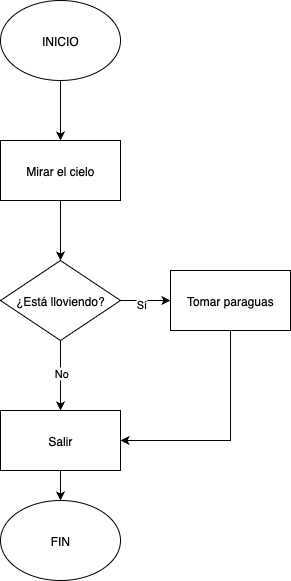
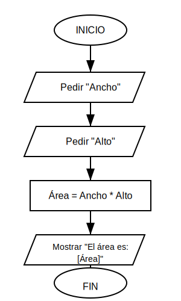

                    
<!-- _header:  Principios de informática  -->

# Diagramas de flujo 🗺️

---

## ¡Hola, Futuro Programador! 👋

---

**¿Qué es un Diagrama de Flujo?**
Es un **mapa visual** de los pasos y decisiones para resolver un problema. ¡Como una receta!

---

**¿Para qué sirven?** 🤔
Nos ayudan a **planificar** y **entender** cómo funciona un programa antes de escribir código.

---

## Símbolos Esenciales 🔑

---

**Cada forma tiene un significado.**
¡Son nuestro vocabulario visual!

---

**1. Inicio / Fin (Terminal)** ⚪
Marca el **principio** o el **final** del proceso.

---

**2. Proceso (Acción)** 🟩
Una **tarea** o **acción** a realizar.

---

**3. Entrada / Salida (Datos)** 🟦
Para **pedir información** o **mostrar resultados**.

---

**4. Decisión (Condicional)** 🔶
Se hace una **pregunta** con dos respuestas: **Sí** o **No**.

---

**5. Línea de Flujo (Flecha)** ➡️
Conecta los símbolos y muestra la **dirección** del proceso.

---

## ¡Tu Primer Diagrama! 🚶‍♀️

---

**Ejemplo: ¿Llevo Paraguas? ☔**
Vamos a dibujar el proceso de decidir si necesitamos un paraguas.

---

**Paso 1: El Inicio**
Todo comienza con el símbolo de **INICIO**.

---

**Paso 2: La Primera Acción**
Después de iniciar, ¿qué hacemos? ¡**Mirar el cielo**!

---

**Paso 3: La Decisión Crucial**
Ahora que sabemos cómo está el cielo, ¿**está lloviendo**?

---

**Paso 4: Dos Caminos, Un Final**
Si "Sí", tomamos paraguas. Si "No", salimos sin él. Ambos caminos nos llevan al **FIN**.

---

**¡Así se lee el diagrama!**
*   **INICIO**: Empezamos.
*   **Mirar el cielo**: Una acción simple.
*   **¿Está lloviendo?**: Una pregunta con "Sí" o "No".
*   **Tomar paraguas / Salir sin paraguas**: Acciones diferentes según la respuesta.
*   **FIN**: El proceso termina.

---

## Otro Ejemplo: Par/Impar 🔢

---

**Problema:** Queremos saber si un número es par o impar.

---

**¿Cómo funciona?**
Pedimos un número, decidimos si es par, y mostramos el resultado. ¡Dos caminos, un destino!

---

## ¡Tu Turno! 💪

---

**Ejercicio: Calcular el Área de un Rectángulo**
¡Piensa en los pasos para resolverlo!

---

**Consigna:**
Crea un diagrama de flujo para calcular el área de un rectángulo.

**Recuerda:**
*   Necesitas pedir el **ancho** y el **alto**.
*   La fórmula es: **Área = Ancho \* Alto**.
*   Debes **mostrar el resultado**.

---

## Solución ✅

---

**Diagrama: Área de Rectángulo**

---

**¿Cómo te fue?**
¡Felicidades si te acercaste! Lo importante es entender el flujo de los pasos.

---

## ¿Por qué son útiles en Programación? 💡

---

**1. Claridad** 📝
Ayudan a **organizar tus ideas** antes de escribir código.

**2. Detectar Errores** 🐛
Puedes **seguir el flujo** para encontrar problemas lógicos.

**3. Comunicación** 🗣️
Explican la **lógica** de tu programa a cualquiera.

**4. Pensamiento Lógico** 🧠
Te entrenan a **pensar paso a paso**, clave para programar.

---

**¡Sigue practicando!**
Con ellos, ¡la programación será más fácil y divertida!

---

**¡Gracias!**
**¡A programar se ha dicho!** 🚀