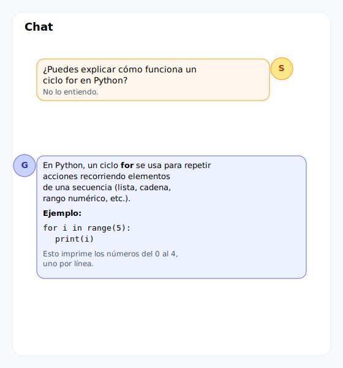
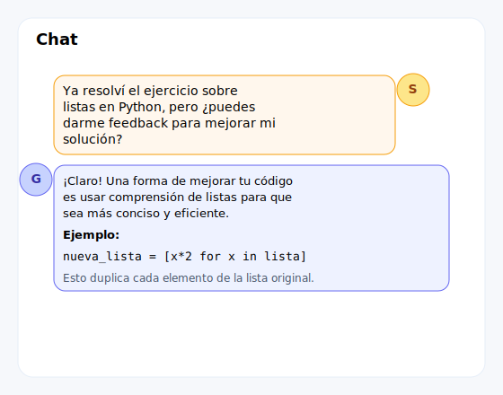
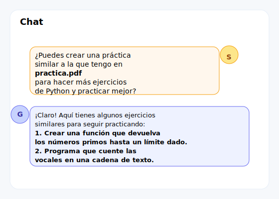

                    
<!-- _header:  Principios de informática  -->

# Usos éticos de la IA 🤖

---

**¡Bienvenido al Futuro!** ✨
La Inteligencia Artificial (IA) es una herramienta poderosa que puede transformar tu aprendizaje.

---

**Pero, ¿cómo la usamos bien?** 🤔
Es crucial entender los límites para que la IA sea tu aliada, no una trampa.

---

## Usos Prohibidos 🚫

---

**¿Qué NO debes hacer?** ⚠️
Usar la IA de forma que comprometa la **integridad académica** es inaceptable. Esto es, no actuar con honestidad, responsabilidad y respeto por las normas éticas en todo lo relacionado con el trabajo académico.

---

**1. Plagio o Falsificación** ❌
Presentar contenido generado por IA como si fuera **totalmente tuyo**.

---

**2. Engaño o Trampa** 🚫
Usar la IA para obtener respuestas en tareas o laboratorios, de forma **deshonesta**.

---

**Ejemplo Prohibido:**
Pedir a la IA que te dé la solución completa a un problema de programación sin que tú lo intentes.

---

**3. Generación de Contenido Inapropiado** 🚨
Crear o difundir material ofensivo, discriminatorio o que viole las normas de conducta del curso.

---

**Consecuencias** ⚖️
Recuerda que la carta al estudiante indica que:
> Es **ilegal** presentar como propio, código parcial o total escrito por otras personas u obtenido de fuentes de información, como por ejemplo de libros, de **herramientas de inteligencia artificial** (como ChatGPT), o de Internet, **sin la autorización expresa de la persona docente**.

---

**Recuerda:** Tu aprendizaje y tu ética son lo más valioso. 🧠

---

## Usos Aceptables ✅

---

**¿Cómo la IA puede ser tu Súper Aliada?** 💡
Usa la IA para **potenciar tu aprendizaje**, no para evitarlo.

---

**1. Herramienta de Aprendizaje y Comprensión** 📚
Usa la IA para aclarar conceptos, explorar ideas y profundizar tu entendimiento.

---

---

**2. Asistente de mejoras** ✍️
Una vez ya resolviste un ejercicio **por tu cuenta**, puedes pedirle a alguna herramienta que dé feedback de tu solución al problema. ¡Puede darte una mejor solución y tú la estudias!

---

*OJO*: **No significa que tengas que copiar la solución de la herramienta**, porque ya estarías incluyendo código que no es tuyo. La idea es **mejorar tus habilidades de entendimiento y programación**.

---

---

**3. Crear nuevos ejercicios** 🐍
La IA puede ser un excelente compañero para crear ejercicios similares a los que ya tienes. ¡Puedes crear más prácticas!

---

---

**Principios Clave para el Uso Ético** ✨
---

---

**1. Responsabilidad** 🧑‍💻
Eres el **responsable final** de todo el contenido que entregas.

---

**2. Verificación** ✅
Siempre **verifica la información** generada por la IA. Puede contener errores o "alucinaciones".

---

**3. Aprendizaje Activo** 🧠
Usa la IA para **aprender y mejorar tus habilidades**, no para evitar el esfuerzo intelectual.

---

**¡Sé un Maestro de la IA!** 🚀
Usa la Inteligencia Artificial con sabiduría y ética para potenciar tu camino educativo.