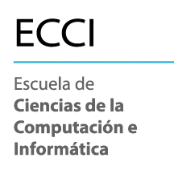
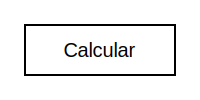
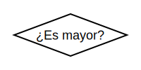
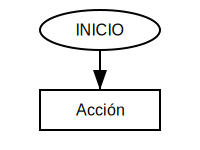
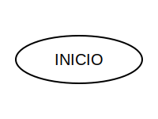
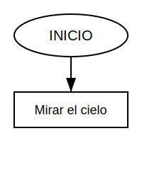
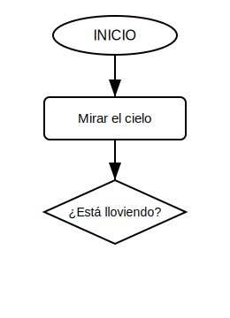
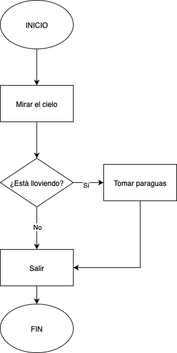
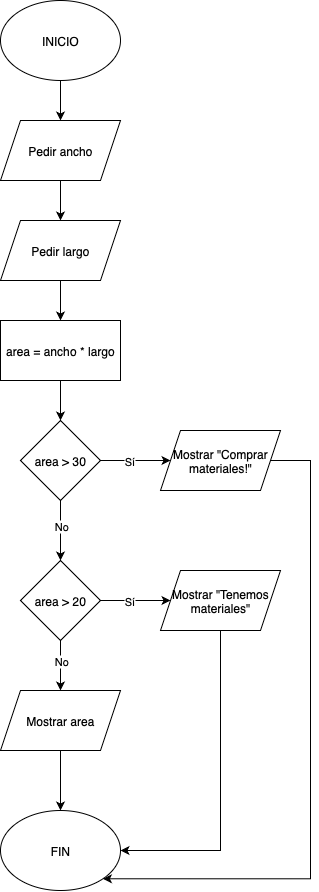

                    
<!-- _header:  Principios de informática  -->

# Diagramas de flujo 🗺️

---

## Introducción 👋

---

**Definición de Diagrama de Flujo**
Un **diagrama de flujo** es una representación gráfica que ilustra los pasos y decisiones necesarios para resolver un problema o ejecutar un proceso.

---

**Propósito** 🤔
Los diagramas de flujo permiten **planificar** y **comprender** la lógica de un programa antes de su implementación en código.

---

## Símbolos Esenciales 🔑

---

**Símbolos básicos utilizados en diagramas de flujo.**
Cada símbolo representa un tipo específico de operación o elemento del proceso.

---

**1. Inicio / Fin (Terminal)** ⚪
Indica el **punto de inicio** o **finalización** del proceso.

---

**2. Proceso (Acción)** 🟩
Representa una **operación** o **acción** específica a ejecutar.

---

**3. Entrada / Salida (Datos)** 🟦
Utilizado para **solicitar información** o **mostrar resultados**.

---

**4. Decisión (Condicional)** 🔶
Representa una **condición** que requiere una respuesta de **Sí** o **No**.

---

**5. Línea de Flujo (Flecha)** ➡️
Conecta los símbolos e indica la **secuencia** del proceso.

---

## Ejemplo Práctico 🚶‍♀️

---

**Caso de estudio: Decisión sobre llevar paraguas ☔**
Análisis del proceso de toma de decisión basado en condiciones meteorológicas.

---

**Paso 1: Punto de inicio**
El proceso inicia con el símbolo **INICIO**.

---

**Paso 2: Acción inicial**
Se ejecuta la acción **"Mirar el cielo"**.

---

**Paso 3: Evaluación de condición**
Se evalúa la condición: **"¿Está lloviendo?"**

---

**Paso 4: Rutas alternativas**
Según la respuesta, se ejecutan acciones diferentes que convergen en el punto **FIN**.

---

**Interpretación del diagrama:**

* **INICIO**: Punto de partida del proceso.
* **Mirar el cielo**: Acción de observación.
* **¿Está lloviendo?**: Condición con respuesta binaria.
* **Tomar paraguas / Salir sin paraguas**: Acciones resultantes según la evaluación.
* **FIN**: Terminación del proceso.

---

## Ejemplo Adicional: Verificación de Edad 🎂

---

Determinar si una persona es mayor de edad o menor de edad.

**Descripción del proceso:** Se solicita la edad como entrada. Luego, se evalúa si el valor ingresado es mayor o igual a 18. Dependiendo del resultado, se muestra un mensaje indicando si la persona es mayor de edad o no.

---

## Ejercicio Práctico 💪

---

**Actividad: Calcular el Área de un Rectángulo**
Desarrolle un diagrama de flujo para resolver este problema matemático.

---

Diseñe un diagrama de flujo para calcular el área de un rectángulo.

**Elementos requeridos:**

* Solicitar el **ancho** y el **alto** como datos de entrada.
* Aplicar la fórmula: **Área = Ancho × Alto**.
* Si el área es **mayor a 30** hay que mostrar el mensaje "¡Comprar materiales!"
* Si el área es **mayor a 20** pero **menor o igual que 30** hay que mostrar el mensaje "Tenemos materiales"
* Si el área es **menor o igual que 20** hay que mostrar el resultado obtenido nada más.

---

## Solución ✅

---

**Propuesta de solución:**

---

**Evaluación del ejercicio:**
El objetivo principal es comprender la secuencia lógica de los pasos necesarios para resolver el problema.

---

## Importancia en el Desarrollo de Software 💡

---

**1. Claridad** 📝
Facilitan la **organización conceptual** previa a la implementación del código.

**2. Detección de Errores** 🐛
Permiten **identificar problemas lógicos** mediante el seguimiento sistemático del flujo.

**3. Comunicación** 🗣️
Proporcionan una **representación universal** de la lógica del programa.

---

**4. Desarrollo del Pensamiento Lógico** 🧠
Fomentan el **razonamiento secuencial**, fundamental para la programación.

---

**Recomendación:**
La práctica constante con diagramas de flujo mejora significativamente las habilidades de programación.

---

**Conclusión**
Los diagramas de flujo constituyen una herramienta fundamental en el proceso de desarrollo de software. 🚀
