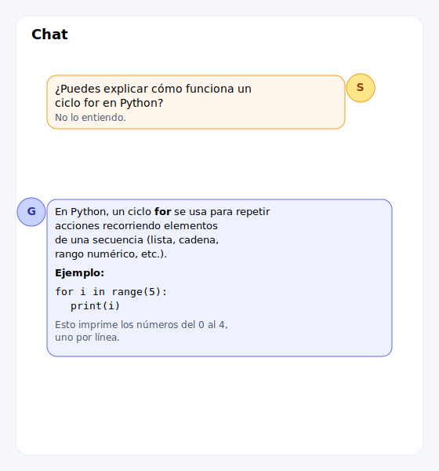
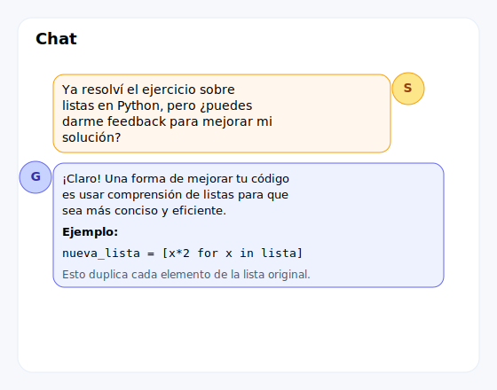
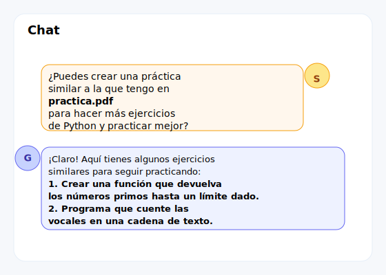

                    
<!-- _header:  Principios de informática  -->

# Usos éticos de la IA 🤖

---

## Introducción ✨

La Inteligencia Artificial (IA) constituye una herramienta tecnológica de gran potencial para el proceso de aprendizaje académico.

---

## Marco Ético 🤔

Es fundamental establecer parámetros claros para el uso apropiado de la IA en el contexto educativo universitario.

---

## Usos Prohibidos 🚫

---

**Definición de prácticas inadecuadas** ⚠️
El uso inapropiado de la IA compromete la **integridad académica**, definida como la actuación con honestidad, responsabilidad y respeto por las normas éticas en el trabajo académico.

---

**1. Plagio o Falsificación** ❌
Presentar contenido generado por IA como trabajo **original propio**.

---

**2. Deshonestidad Académica** 🚫
Utilizar la IA para obtener respuestas en evaluaciones o laboratorios de manera **no autorizada**.

---

**Ejemplo de práctica inadecuada:**
Solicitar a la IA la solución completa de un problema de programación sin realizar previamente el proceso de análisis y desarrollo personal.

---

**3. Generación de Contenido Inapropiado** 🚨
Crear o distribuir material que viole las normas de conducta académica o contenga elementos discriminatorios.

---

**Marco normativo institucional** ⚖️
Según la carta al estudiante:
> Es **ilegal** presentar como propio, código parcial o total escrito por otras personas u obtenido de fuentes de información, como por ejemplo de libros, de **herramientas de inteligencia artificial** (como ChatGPT), o de Internet, **sin la autorización expresa de la persona docente**.

---

**Nota importante:** La integridad académica y el aprendizaje efectivo constituyen los valores fundamentales del proceso educativo. 🧠

---

## Usos Aceptables ✅

---

**Aplicaciones apropiadas de la IA** 💡
La IA debe utilizarse como herramienta de **apoyo al aprendizaje**, no como sustituto del proceso educativo.

---

**1. Herramienta de Aprendizaje y Comprensión** 📚
Utilizar la IA para aclarar conceptos, explorar ideas y profundizar la comprensión de temas específicos.

---

---

**2. Asistente de Retroalimentación** ✍️
Después de resolver un ejercicio de forma independiente, solicitar retroalimentación sobre la solución desarrollada para identificar áreas de mejora.

---

**Consideración metodológica**: El objetivo es **desarrollar habilidades de comprensión y programación**, no incorporar código externo sin proceso de aprendizaje previo.

---

---

**3. Generación de Ejercicios Adicionales** 🐍
Utilizar la IA para crear ejercicios similares a los existentes, facilitando la práctica adicional.

---

---

**Principios Fundamentales para el Uso Ético** ✨

---

**1. Responsabilidad Académica** 🧑‍💻
El estudiante mantiene la **responsabilidad completa** sobre todo el contenido presentado en sus trabajos.

---

**2. Verificación de Información** ✅
Es obligatorio **verificar y validar** toda información generada por IA, considerando la posibilidad de errores o información inexacta.

---

**3. Aprendizaje Activo** 🧠
La IA debe emplearse para **fortalecer el proceso de aprendizaje**, no para evitar el desarrollo de habilidades intelectuales.

---

**Conclusión** 🚀
El uso responsable de la Inteligencia Artificial requiere equilibrio entre aprovechamiento tecnológico y desarrollo académico personal.
