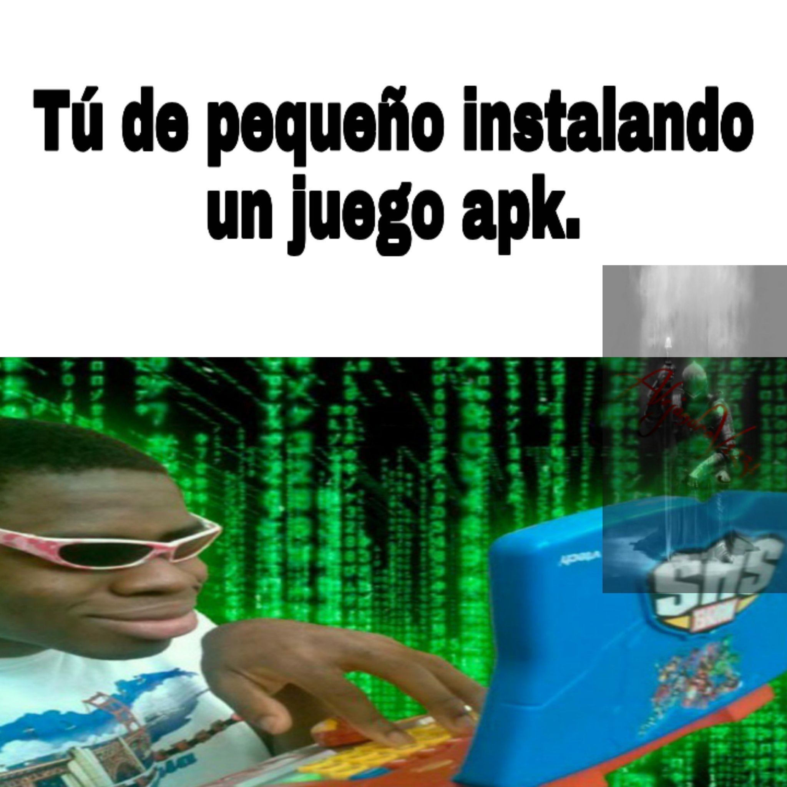
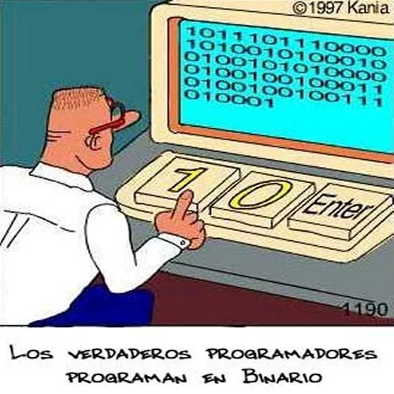
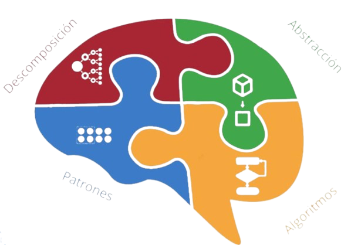
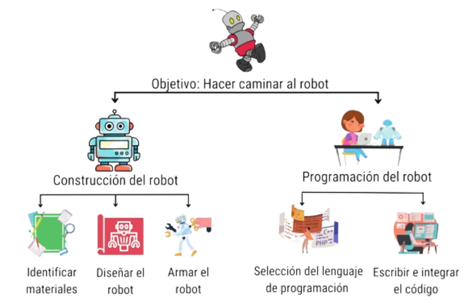
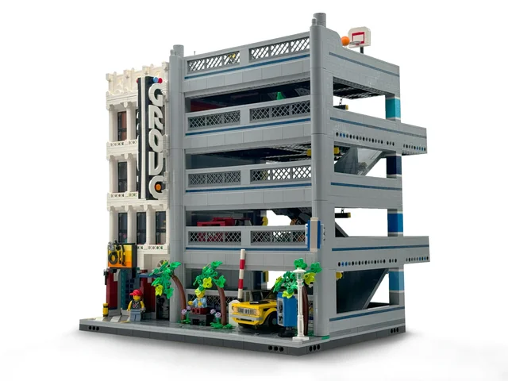
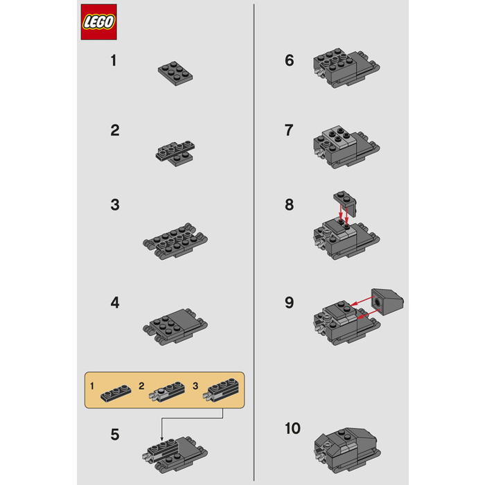
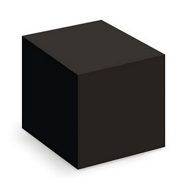
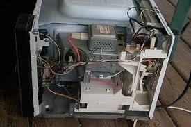

                    
<!-- _header:  Principios de informática  -->

# 1. Fundamentos de la programación 🚀

---

## 💡 Tu Viaje Comienza Aquí

---

**¡Hola, futuro programador!**
Prepárate para desvelar los secretos de cómo las computadoras "piensan" y cómo puedes hablar con ellas. 🧠

---

**¿Por qué aprender esto?**
Dominarás el arte de resolver problemas, creando soluciones digitales que impactan el mundo. ✨ ¡Piensa en grande!

---

## 🔢 Conceptos Fundamentales

---

**¿Qué es un Algoritmo?**
Es una **secuencia finita y ordenada de pasos** o **instrucciones definidas** para resolver un problema o realizar una tarea.

---

**Algoritmo: Una Receta 🧑‍🍳**
Imagina hacer una torta:

1. Mezclar ingredientes.
2. Hornear a X grados.
3. Dejar enfriar.
¡Cada paso es crucial!

---

**¿Qué es Software?**
Son las **instrucciones y datos** que le dicen a una computadora qué hacer.
Es lo "intangible" de tu dispositivo. 👻

---

**Software: Ejemplos Cotidianos**

* Tu navegador web 🌐
* La app de tu banco 💰
* Un videojuego 🎮

---

**¿Qué es Hardware?**
Es la **parte física y tangible** de una computadora o dispositivo electrónico: los **componentes** que puedes tocar, como el teclado, la pantalla, el disco duro, el procesador, etc.

---

**Hardware: Ejemplos Cotidianos**

* Teclado ⌨️
* Monitor 🖥️
* Disco duro 💽
* Memoria RAM 📀

---

**¿Qué es Programación?**
Es el **proceso de escribir instrucciones** (código) para que una computadora las ejecute.
¡Es hablar con la máquina en su idioma! 🗣️💻

---

**¿Qué es un Lenguaje de Programación?**
Es un **conjunto de reglas y símbolos** que usamos para escribir esas instrucciones.
¡Como un idioma especial para computadoras! 💬

---

**Python: Nuestro Idioma Favorito 🐍**

* **Fácil de leer:** Parece inglés.
* **Versátil:** Para web, ciencia, juegos, ¡casi todo!
* **Potente:** Usado por Google, Netflix, NASA.

---


---

**Código fuente**

```python
numero_secreto: int = 7
adivinado: bool = False

while not adivinado:
    try:
        intento_str = input('Adivina el número secreto (entre 1 y 10): ')
        intento_num = int(intento_str)
        if intento_num == numero_secreto:
            print('🎉 ¡Felicidades! ¡Adivinaste!')
            adivinado = True
        else:
            print('🤔 Intenta de nuevo.')
    except ValueError:
        print('Por favor, ingresa un número válido.')
```

---





---

**Construcción y Ejecución de un Programa**
Es el camino desde tu idea hasta que la computadora la entiende y la realiza.

---

**El Flujo del Programa ➡️**
Tu Código (Python) ✍️
⬇️
Intérprete de Python 🐍 (lo "traduce")
⬇️
Computadora 💻 (lo "ejecuta")
⬇️
Resultado ✅

---


## Bases 🧠



---

#### A. Descomposición ፨

**Separar** los problemas en partes más **pequeñas** y manejables


---



---

La **descomposición** ayuda a que los problemas grandes sean menos abrumadores

---

#### B. Patrones 🚧

**Recetas** o **fórmulas** que nos ayudan a entender similitudes en los datos o en las situaciones. Esto nos permite resolver problemas de forma más **eficiente**.

---



<===>



---

**¿En la práctica?**

Son soluciones **reutilizable**. Son guías

Existen muchos patrones ya identificados. Ayudan a hacer **buenos** programas y más **rápido**.

---

#### C. Abstracción 🔳

**Esconder** el detalle de algo muy complejo. Se enfoca en **qué** hace algo, y **no cómo** lo hace.



---


??



---

La **abstracción** permite no abrumarse con todos los detalles de cada instrucción o pasos de un programa.


---

#### D. Algoritmos 🧮

Secuencia **finita** y **ordenada** de instrucciones o pasos **bien definidos**, para **resolver** un problema

---

## ♻️ Ciclo de Desarrollo de Software (SDLC)

---

**¿Cómo se crea software de calidad?**
No es magia, es un proceso organizado, ¡como construir un edificio! 🏗️

---

**Fase 1: Análisis 🔍**
**¿Qué problema estamos resolviendo?**

* Entender las **necesidades** del usuario.
* Definir los **objetivos** del programa.
* ¡La fase más crítica!

---

**Fase 2: Diseño ✏️**
**¿Cómo vamos a resolverlo?**

* Planificar la **estructura** del programa.
* Pensar en los **algoritmos** necesarios.
* ¡El "plano" antes de construir!

---

**Fase 3: Implementación 💻**
**¡Manos a la obra: a programar!**

* Traducir el diseño a **código**.
* Escribir las **instrucciones** en Python.
* ¡Aquí es donde la magia cobra vida!

---

**Fase 4: Prueba ✅**
**¿Funciona como esperábamos?**

* Buscar **errores** (bugs).
* Asegurarse de que cumple todos los **requisitos**.
* ¡Ajustar y pulir hasta la perfección! ✨

---

**SDLC: Resumen Visual**
Análisis ➡️ Diseño ➡️ Implementación ➡️ Prueba
(y a menudo, volver a empezar para mejorar) 🔄

---

## 🗺️ Pensamiento Computacional para Problemas

---

**¿Qué es el Pensamiento Computacional?**
Es una forma de **resolver problemas** usando técnicas que usan los científicos de la computación.
¡No es solo para programadores! Es una habilidad para la vida. 🌟

---

**Paso 1: Comprensión del Problema 🤔**

* **¿Qué me piden?**
* **¿Cuál es el objetivo final?**
* **¿Qué información tengo?**
* **¿Qué necesito obtener?**
¡Entender antes de actuar!

---

**Paso 2: Descomposición del Problema 🧩**

* Dividir un problema grande en **partes más pequeñas y manejables**.
* Resolver cada parte por separado.
* ¡Como un rompecabezas!

---

**Paso 3: Especificación del Algoritmo 📝**

* Describir los **pasos detallados** para resolver cada subproblema.
* Puede ser en lenguaje natural, diagramas de flujo o pseudocódigo.
* ¡La "receta" lista para codificar!

---

**Paso 4: Codificación ✍️**

* Traducir el algoritmo a un **lenguaje de programación** (Python).
* Escribir las instrucciones línea por línea.
* ¡Aquí aplicas tu conocimiento de Python!

---

**Paso 5: Validación (Prueba y Depuración) ✅**

* **Ejecutar** el código.
* **Verificar** si el resultado es correcto.
* Si hay errores (bugs), **identificarlos y corregirlos**.
* ¡Asegurarse de que todo funciona perfectamente!

---

**Metodología: Flujo Total**
Problema Grande ➡️ Descomponer ➡️ Algoritmo Detallado ➡️ Código ➡️ Validar ✅

---

**Ejercicio 1: Pensando en Pasos 🚶‍♀️**
**Consigna:** Quieres escribir un programa que pida tu nombre y tu edad, y luego diga "Hola [Tu Nombre], tienes [Tu Edad] años."
Aplica los 5 pasos del pensamiento computacional.

---

**Ejercicio 1: Solución (Ejemplo) 💡**

* **Comprensión:** Necesito pedir nombre y edad, luego mostrar un saludo personalizado.
* **Descomposición:**
  * Pedir nombre.
  * Pedir edad.
  * Formar el mensaje.
  * Mostrar el mensaje.

---

* **Especificación del Algoritmo:**
    1. Preguntar "Cuál es tu nombre?". Guardar respuesta.
    2. Preguntar "Cuántos años tienes?". Guardar respuesta.
    3. Crear frase combinando "Hola", nombre, "tienes", edad, "años.".
    4. Mostrar la frase.
* **Codificación:** (Ver siguiente slide)
* **Validación:** Ejecutar el código, ingresar datos y verificar que la frase sea correcta.

---

**Ejercicio 2: Código de Solución ✅**

```python
# Codificación
nombre = input("¿Cuál es tu nombre? ")
edad = input("¿Cuántos años tienes? ")
mensaje = "Hola " + nombre + ", tienes " + edad + " años."
print(mensaje)
```

---

## 🛠️ Entorno de Programación

---

**¿Dónde escribimos y ejecutamos código?**
Necesitas un **"taller"** para tus programas.
Esto es un **Entorno de Programación**. 🖥️

---

**Componentes Clave:**

* **Editor de Texto:** Donde escribes tu código (como Word, pero para código).
* **Intérprete/Compilador:** Traduce tu código a lenguaje de máquina. (Python usa un intérprete).
* **Consola/Terminal:** Donde ves los resultados de tu programa.

---

**IDEs (Entornos de Desarrollo Integrados)**
Son programas que **combinan** todo lo anterior en uno solo.
¡Tu taller completo en una sola herramienta! 🚀

---

**Ejemplos de IDEs para Python:**

* **VS Code (Visual Studio Code):** Popular, flexible, muchas extensiones.
* **PyCharm:** Muy potente para desarrollo profesional.
* **Jupyter Notebooks:** Ideal para análisis de datos y aprendizaje interactivo.

---

## ✍️ Instrucciones y Sus Tipos

---

**¿Qué es una Instrucción?**
Es la **unidad más básica** de un programa.
Una sola orden que le das a la computadora. 🗣️

---

**Tipos de Instrucciones Comunes:**

1. **Declaraciones**
2. **Asignaciones**
3. **Control de Flujo**
4. **Entrada y Salida (I/O)**

---

**Tipo 1: Declaraciones (Variables) 🏷️**

* Sirven para **nombrar "contenedores"** donde guardamos información.
* Piensa en una etiqueta para una caja.
* `nombre_caja = valor_dentro`

---

**Ejemplo de Declaración**

```python
saludo = "Hola"  # Declara 'saludo' y guarda el texto "Hola"
edad = 30        # Declara 'edad' y guarda el número 30
```

**`saludo` y `edad` son variables.**

---

En lenguajes de programación como c++, se declara sin asignar un valor:

```cpp
int x;  // declaración de una variable entera llamada x, sin valor asignado aún
```

---

**Tipo 2: Asignaciones ➡️**

* **Dar un valor** a una variable.
* Se usa el signo `=` (no significa "igual", sino "asigna").

---

**Ejemplo de Asignación**

```python
x = 10      # Asigna el valor 10 a la variable x
x = x + 5   # Asigna el valor de (x actual + 5) a x (ahora x es 15)
```

¡Las variables pueden cambiar su valor!

* OJO 👀: La primera vez que se asigna un valor a una variable, se está declarando.

---

**Tipo 3: Control de Flujo 🚦**

* Cambian el **orden normal** en que se ejecutan las instrucciones (de arriba a abajo).
* Permiten tomar **decisiones** o **repetir** acciones.

---

**Control de Flujo: Condicionales (Decisiones) 🤔**

* **`if` (si):** Ejecuta un bloque de código **si** una condición es verdadera.
* **`else` (si no):** Ejecuta otro bloque **si no** lo es.

---

**Ejemplo: Condicional `if-else`**

```python
temperatura = 25
if temperatura > 20:
    print("¡Qué calor!")
else:
    print("Clima agradable.")
```

**El programa decide qué mensaje mostrar.**

---

**Control de Flujo: Bucles (Repeticiones) 🔁**

* **`for`:** Repite un bloque de código un **número fijo de veces** o para cada elemento en una secuencia.
* **`while`:** Repite un bloque de código **mientras** una condición sea verdadera.

---

**Ejemplo: Bucle `for`**

```python
for numero in range(3): # Repite 3 veces (0, 1, 2)
    print("Contando:", numero)
```

**Salida:**
Contando: 0
Contando: 1
Contando: 2

---

**Tipo 4: Entrada y Salida (I/O) ↔️**

* **Entrada (`input()`):** Recibir datos del usuario (desde el teclado).
* **Salida (`print()`):** Mostrar información al usuario (en la pantalla).

---

**Ejemplo: Entrada y Salida**

```python
nombre = input("¿Cómo te llamas? ") # Entrada
print("¡Hola, " + nombre + "!")     # Salida
```

**Permite que tu programa interactúe.**

---

## 🌟 ¡Felicidades

---

**Has completado un gran primer paso.**
Ahora entiendes los **pilares de la programación**.
¡Sigue practicando, la mejor forma de aprender es haciendo! 🚀

---

**"Todo el mundo en este país debería aprender a programar un ordenador... porque te enseña a pensar."**
**— Steve Jobs**

---

**¡A programar se ha dicho!** 🐍✨
