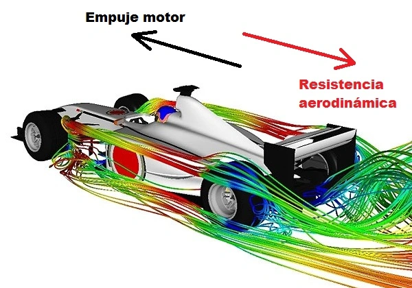

# **Práctica de examen 1: Análisis del Coeficiente de Arrastre ($C_D$)**

## Contexto

En ingeniería aerodinámica, la **Fuerza de Arrastre ($F_D$)** es una fuerza clave que se opone al movimiento de un cuerpo a través de un fluido. Para caracterizar el rendimiento de un vehículo o modelo, utilizamos el **Coeficiente de Arrastre ($C_D$)**, una magnitud adimensional que debe ser constante para un cuerpo dado a altas velocidades.

La relación fundamental es:

$$C_D = \frac{F_D}{0.5 \rho V^2 A}$$

Donde:

* $F_D$: Fuerza de Arrastre (N)
* $\rho$: Densidad del fluido ($kg/m^3$)
* $V$: Velocidad del flujo ($m/s$)
* $A$: Área de referencia ($m^2$)

Usted ha recibido datos de una serie de pruebas en un túnel de viento realizadas sobre un modelo a escala. La densidad del aire ($\rho$) durante la prueba fue de **$1.225 \, kg/m^3$** y el área de referencia ($A$) del modelo es de **$0.5 \, m^2$**.

**Suponga que ya existe** un archivo de datos llamado `wind_tunnel_data.csv` con la siguiente estructura de columnas:

| Columna | Tipo de Dato | Unidad | Descripción |
| :--- | :--- | :--- | :--- |
| **Test\_ID** | `int` | N/A | Identificador único de la prueba. |
| **Velocity\_mps** | `float` | $m/s$ | Velocidad medida ($V$). |
| **Drag\_Force\_N** | `float` | $N$ | Fuerza de Arrastre medida ($F_D$). |

## Instrucciones

1. **Carga de Datos:** Utilice la biblioteca **Pandas** para cargar el archivo `wind_tunnel_data.csv` en un *DataFrame*.
2. **Preparación de Variables:** Una vez cargado, extraiga las columnas `Drag_Force_N` y `Velocity_mps` y conviértalas a **arrays de NumPy** para su uso en cálculos numéricos eficientes.

Para mantener el código organizado, deberá desarrollar un módulo llamado `aero_calcs.py` que contenga las funciones de cálculo:

* Defina las constantes $\rho = 1.225$ y $A = 0.5$ dentro de este módulo.
* **Función `calculate_cd(F_D, V, rho, A)`:** Implemente la función que calcula el $C_D$ utilizando las fórmulas vectorizadas de NumPy. Debe devolver un *array* con los coeficientes de arrastre calculados.
* **Función `calculate_drag_force(C_D, V, rho, A)`:** Implemente la función que calcula la fuerza de arrastre teórica $F_D$ para una $C_D$ constante dada y un *array* de velocidades $V$.

**Cálculo en el Script Principal:**

* Desde su script principal, importe el módulo `aero_calcs`.
* Utilice la función `calculate_cd` para obtener la serie de **$C_D$** para cada punto de prueba.
* Agregue esta serie de $C_D$ como una nueva columna, `Coefficient_of_Drag`, al DataFrame de Pandas.
* Calcule el **valor promedio** del Coeficiente de Arrastre (`CD_avg`) a partir de la nueva columna del DataFrame.

La tarea final es demostrar la consistencia del Coeficiente de Arrastre mediante la visualización de los datos experimentales y el modelo teórico.

1. **Modelo Teórico:**
    * Genere un *array* de **100 puntos de velocidad** uniformemente espaciados, que abarque todo el rango de velocidades de los datos experimentales.
    * Utilice la función `calculate_drag_force` del módulo `aero_calcs` y el valor `CD_avg` para generar la curva de **Fuerza de Arrastre Teórica** para estos 100 puntos.

2. **Gráfico Principal ($F_D$ vs. $V$):**
    * Utilice **Matplotlib** para generar un gráfico comparativo de la Fuerza de Arrastre ($F_D$) en función de la Velocidad ($V$).
    * Grafique los **datos experimentales** como puntos dispersos.
    * Superponga la **curva del Modelo Teórico** (la función cuadrática basada en $CD\_avg$) como una línea.
    * Asegúrese de etiquetar los ejes y añadir una leyenda que distinga los datos medidos del modelo teórico.

3. **Gráfico de Consistencia ($C_D$ vs. $V$):**
    * Genere un segundo gráfico que muestre cómo varía el $C_D$ calculado con la velocidad.
    * Grafique los valores de la columna `Coefficient_of_Drag` contra `Velocity_mps`.
    * Trace una **línea horizontal** que represente el valor constante `CD_avg`, demostrando la naturaleza aproximadamente constante del coeficiente.
