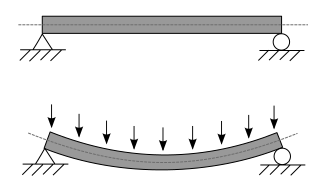

# **Práctica de examen 2: Comparación de Materiales y Carga Límite**

## Contexto

Usted está analizando la viabilidad de dos tipos de acero diferentes para una viga que debe soportar una carga sin exceder el límite de deflexión. La deflexión máxima ($\delta$) es la métrica crítica:

$$\delta = \frac{5 w L^4}{384 E I}$$

El límite de deflexión es $\delta_{limite} = L/360$.

donde:

- **w**: Carga (N/m)
- **L**: Longitud de la viga — **12.0** (m)
- **I**: Momento de inercia de la sección — **1.5 × 10^-4** (m^4)
- **E_A**: Módulo de elasticidad del acero A — **200 × 10^9** (Pa)
- **E_B**: Módulo de elasticidad del acero B — **180 × 10^9** (Pa)

---

## Instrucciones

Implemente las siguientes funciones en un módulo llamado `struc_calcs`, utilizando **NumPy**:

1. **Función `calcular_delta(w, L, E, I)`:**
    * Implemente la fórmula principal de deflexión ($\delta$).
    * Acepte un array de $w$ y devuelva un array con los valores de deflexión ($\delta$).

2. **Función `calcular_carga_limite(delta_limite, L, E, I)`:**
    * Implemente la fórmula para calcular la **carga distribuida máxima admisible ($w_{max}$)**:
        $$w_{max} = \frac{384 E I \delta_{limite}}{5 L^4}$$
    * Devuelva un único valor de $w_{max}$.

3. **Función `calcular_delta_limite(L)`:**
    * Implemente la fórmula para calcular $\delta_{limite}$ dada la longitud.

---

Ahora, se van a pedir algunos datos:

1. **Solicitar número de muestras:** Pida al usuario que ingrese el número total de muestras (`N`) de pruebas de carga que se van a simular.
2. **Generación de cargas base:** Utilice **NumPy** (`linspace`) para crear un array de `N` puntos de Carga Distribuida ($w$), variando desde $1,000 \, N/m$ hasta $5,000 \, N/m$.
3. **Simulación Interactiva y Carga:**
    * Para cada valor de carga ($w_i$) generado haga lo siguiente:
        * **Solicite al usuario** (usando `input()`) que ingrese el **porcentaje máximo de ruido** (ej. `5.0` para 5%) que se debe aplicar a la muestra específica ($w_i$).
        * **Cálculo de $\delta_{medida}$:**
            * Calcule la Deflexión Teórica ($\delta_{teorica}$) para esa muestra $w_i$ utilizando el **Acero A** ($E_A$).
            * Genere un valor de ruido aleatorio que sea un porcentaje del valor teórico, utilizando **NumPy** (`np.random.uniform`) para obtener un valor aleatorio entre $\pm$ (porcentaje ingresado por el usuario) de $\delta_{teorica}$.
            * Calcule la **Deflexión Medida** ($\delta_{medida}$) sumando $\delta_{teorica}$ y el ruido aleatorio.
        * Recoja los datos de $w_i$ y $\delta_{medida}$ en listas para su posterior conversión.
4. **Creación del DataFrame:** Compile las columnas `Test_ID`, `Carga_w_Nm` y `Deflexion_medida_m` en un **DataFrame** de **Pandas**.

Luego, se proceden a hacer cálculos:

1. **Validación Experimental:**
    * Utilice la función `calcular_delta` para obtener la **Deflexión Teórica ($\delta_{A\_teorica}$)** para cada Carga ($w$) presente en el DataFrame (usando $E_A$).
    * Calcule el **error promedio** (en porcentaje) entre la $\delta_{A\_teorica}$ y la $\delta_{medida}$ para validar el modelo teórico.
2. **Cálculo de Cargas Límite:**
    * Calcule la deflexión límite de servicio: $\delta_{limite} = L/360$.
    * Utilice la función `calcular_carga_limite` para determinar la carga máxima admisible ($w_{max}$) para **ambos materiales (Acero A y Acero B)**.

Por último, se deben enerar visualizaciones

1. **Modelo de Curvas:** Defina un array de cargas de prueba (100 puntos) para el rango de modelado.
2. **Gráfico Único y Comparativo:** Genere un solo gráfico que muestre:
    * La **Curva de Deflexión Teórica** vs. Carga para el **Acero A**.
    * La **Curva de Deflexión Teórica** vs. Carga para el **Acero B**.
    * Los **Datos Experimentales Simulados** (puntos dispersos generados interactivamente).
    * Una **línea horizontal** en la $\delta_{limite}$ (Deflexión Máxima Permitida).
    * **Líneas verticales** que marquen la **Carga Máxima Admisible ($w_{max}$)** para cada material.
3. Asegúrese de que el gráfico utilice unidades convenientes (ej. Carga en $kN/m$ y Deflexión en $mm$) e incluya leyenda, títulos y etiquetas de ejes.
