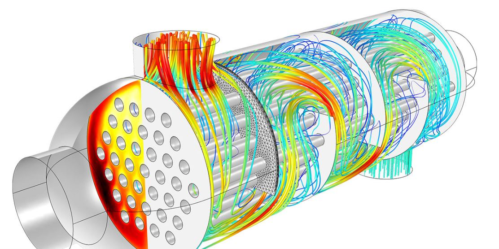

# **Práctica de examen 3: Análisis de Sensibilidad y Diseño en Intercambiadores de Calor**

Un intercambiador de calor es un dispositivo que transfiere energía térmica entre fluidos a diferentes temperaturas. En el arreglo a contracorriente, los fluidos se mueven en direcciones opuestas, maximizando la transferencia.



En la industria, el diseño de intercambiadores es crítico. El **Coeficiente Global de Transferencia de Calor ($U$)** depende directamente de los materiales de construcción y el estado de limpieza de las superficies (incrustaciones). Un valor alto de $U$ indica un material eficiente (como el Cobre) y resulta en una rápida caída de la temperatura del fluido caliente. El ingeniero debe sopesar el costo del material (mayor $U$) frente a la longitud requerida del equipo.

## **Objetivo del Análisis:**

Simular el **perfil de temperatura** del fluido caliente a lo largo del intercambiador para tres escenarios de material, evaluando la temperatura de salida en cada caso.

---

## Enunciado del Problema

Se requiere modelar y comparar la distribución de temperatura para un fluido caliente que fluye a través de un intercambiador de calor. Debe utilizar **NumPy, Pandas, y Matplotlib** para realizar el análisis comparativo.

### **Parámetros Fijos del Sistema:**

| Parámetro | Símbolo | Valor | Unidades |
| :--- | :--- | :--- | :--- |
| Longitud Total | $L_{total}$ | $5.0$ | $\text{metros}$ |
| Temp. Entrada Fluido Caliente | $T_{h,i}$ | $360$ | $\text{K}$ |
| Temp. Entrada Fluido Frío | $T_{c,i}$ | $300$ | $\text{K}$ |
| Flujo Másico Fluido Caliente | $\dot{m}_h$ | $0.5$ | $\text{kg/s}$ |
| Capacidad Calorífica | $C_{p,h}$ | $4180$ | $\text{J/(kg} \cdot \text{K)}$ |
| Perímetro de Transferencia | $P$ | $0.15$ | $\text{m}$ |

### **Escenarios de material (Variable $U$):**

| Escenario | Coeficiente $U$ | Descripción |
| :---: | :---: | :--- |
| **Escenario A (Bajo)** | $150 \, W/(m^2 \cdot K)$ | Material económico o altamente incrustado. |
| **Escenario B (Medio)** | $300 \, W/(m^2 \cdot K)$ | Material estándar limpio. |
| **Escenario C (Alto)** | $450 \, W/(m^2 \cdot K)$ | Material de alto rendimiento (ej. Cobre o Aleación especial). |

### **Fórmula de perfil de temperatura:**

La temperatura del fluido caliente, $T_h$, a una distancia $x$ de la entrada es dada por:

$$T_h(x) = T_{c,i} + (T_{h,i} - T_{c,i}) \cdot e^{-K x}$$

Donde $K$ es la Constante de Transferencia que encapsula las propiedades del equipo y el fluido:
$$K = \frac{U P}{\dot{m}_h C_{p,h}}$$

### **Requisitos de Programación y Análisis:**

1. **Módulo de cálculo:**
    * **Defina un módulo (temperatures.py) con una función** nombrada `simular_intercambiador_T_h` que reciba como único argumento el valor del **Coeficiente Global de Transferencia ($U$)**.
    * La función debe utilizar **NumPy** para:
        * Generar un vector $x$ de **100 puntos** uniformemente espaciados de $0$ a $L_{total}$.
        * Calcular la **Constante $K$**.
        * Calcular el vector de **Temperaturas $T_h$** para todos los $x$.
    * La función debe devolver un **DataFrame de Pandas** con las columnas **'Longitud\_x (m)'** y **'Temperatura\_Th (K)'**.

2. **Estructuración y Ejecución (Pandas):**
    * Ejecute la función `simular_intercambiador_T_h` para los valores de $U$ de $150$, $300$, y $450$.
    * Combine los tres DataFrames de salida en un **único DataFrame maestro**. Renombre las columnas de temperatura para identificarlas claramente (ej. **'Th\_U150'**, **'Th\_U300'**, **'Th\_U450'**).
    * Imprima en pantalla el **DataFrame maestro** resultante.

3. **Análisis de Resultados (Pandas):**
    * Utilice **Pandas** para extraer y mostrar en una tabla de resumen los tres valores de la **Temperatura de Salida ($T_{h,o}$)** (Temperatura en $x=L_{total}$) y la **Caída de Temperatura Total ($\Delta T_{total} = T_{h,i} - T_{h,o}$)** para cada uno de los tres escenarios.

4. **Visualización Comparativa (Matplotlib):**
    * Cree un **gráfico de línea único** que muestre la curva de **Temperatura ($T_h$)** vs. **Longitud ($x$)** para los tres escenarios (A, B y C).
    * El gráfico debe ser de alta calidad, incluyendo:
        * Título descriptivo.
        * Etiquetas claras en los ejes con sus unidades.
        * Una **leyenda** que asocie cada línea con el valor de $U$ correspondiente.
        * Una **línea horizontal de referencia** en $T=T_{c,i}$ (300 K) para mostrar el límite termodinámico.

---

## Script Principal y Ejecución

El script principal (fuera de las funciones de cálculo) debe gestionar el menú y la lógica de dependencia.

### Lógica del Menú

El menú es el siguiente:

```txt
--- Analizador de Intercambiadores de Calor ---
1. Realizar Simulación (Generar Datos y Gráfico)
2. Guardar Resultados en Archivo CSV
3. Salir
Seleccione una opción:
```

### 1\. Opción 1: Realizar Simulación (Generar Datos y Gráfico)

Esta opción:

* Llama a la función `simular_intercambiador_T_h` tres veces (para $U=150, 300, 450$).
* Crea el **DataFrame maestro**.
* Realiza el **Análisis de Resultados** (DataFrame de resumen).
* Genera el **Gráfico Matplotlib**.
* **IMPORTANTE:** Marca una bandera (o almacena el DataFrame) para indicar que la simulación ha sido realizada.

### 2\. Opción 2: Guardar Resultados en Archivo CSV

Esta opción debe:

* **Verificar si la Opción 1 ha sido ejecutada.**
    * Si no se ha ejecutado (el DataFrame maestro está vacío o `None`), muestra un mensaje de error y regresa al menú.
    * Si se ha ejecutado, procede:
        * Solicita el nombre del archivo al usuario.
        * Utiliza el bloque `try...except` para proteger el proceso de guardado.

---

## Ejemplo de Ejecución (Demostrando la Restricción)

```txt
--- Analizador de Intercambiadores de Calor ---
1. Realizar Simulación (Generar Datos y Gráfico)
2. Guardar Resultados en Archivo CSV
3. Salir
Seleccione una opción: 2

[ERROR] Debe ejecutar primero la Opción 1 para generar la simulación. Datos no disponibles.

--- Analizador de Intercambiadores de Calor ---
1. Realizar Simulación (Generar Datos y Gráfico)
2. Guardar Resultados en Archivo CSV
3. Salir
Seleccione una opción: 1

[INICIANDO] Simulación del Perfil de Temperatura para U=150, 300, y 450 W/(m^2·K)...

### DataFrame Maestro de Perfiles de Temperatura (Fragmento) ###
      Longitud_x (m)    Th_U150    Th_U300    Th_U450
0             0.000     360.000     360.000     360.000
1             0.051     359.851     359.702     359.554
2             0.101     359.703     359.405     359.109
...
98            4.949     345.548     331.637     318.150
99            5.000     345.390     331.258     317.755

### Análisis de Resultados (Temperaturas Críticas) ###
| Escenario (U) | Temperatura Salida (Th,o) [K] | Caída de Temperatura Total (ΔT total) [K] |
|:--------------|:------------------------------|:----------------------------------------|
| U150          | 345.390                       | 14.610                                  |
| U300          | 331.258                       | 28.742                                  |
| U450          | 317.755                       | 42.245                                  |

[GRÁFICO] Generando y mostrando el gráfico comparativo (Matplotlib)...
[ÉXITO] Simulación y análisis completados. Datos listos para guardar.

--- Analizador de Intercambiadores de Calor ---
1. Realizar Simulación (Generar Datos y Gráfico)
2. Guardar Resultados en Archivo CSV
3. Salir
Seleccione una opción: 2

Ingrese el nombre del archivo (.csv): resultados_analisis.csv
[ÉXITO] Resultados guardados en resultados_analisis.csv.

--- Analizador de Intercambiadores de Calor ---
1. Realizar Simulación (Generar Datos y Gráfico)
2. Guardar Resultados en Archivo CSV
3. Salir
Seleccione una opción: 2

Ingrese el nombre del archivo (.csv): /ruta_prohibida/datos.csv
[ERROR al guardar] No se pudo escribir el archivo. Verifique la ruta y los permisos. (Excepción capturada: la ruta especificada no existe).

--- Analizador de Intercambiadores de Calor ---
1. Realizar Simulación (Generar Datos y Gráfico)
2. Guardar Resultados en Archivo CSV
3. Salir
Seleccione una opción: 3

Saliendo del programa.
```

**Nota**: Su tabla de datos puede verse distinta al imprimirla.
